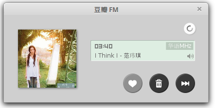

DoubanFM
==================================

喜欢听豆瓣FM，苦于linux没找到豆瓣FM的客户端，又懒得每次打开浏览器网页听豆瓣FM。所以上网找了一下，发现可以使用webkit将豆瓣FM嵌到程序中。

****
####         Author: shawpan
####         E-mail:shawpan@yeah.net

===================================
###        安装：
*   windows系统：直接运行./pyQt+Qtwebkit/dist文件夹中的doubanFM.exe。或者使用py2exe编译源文件，配置文件为./pyQt+Qtwebkit/setup.py
*  linux系统，可以安装gtk版本或者qt版本，个人推荐qt版本，支持最小化到托盘。可以使用脚本一键安装到～/Music文件夹，并建立桌面快捷方式。

###        库依赖：
*   pyQt4
*   gtk
*   webkit

###        原理：
核心就是利用豆瓣FM的一个flash网页：
[豆瓣](http://douban.fm/radio)  
其实像多米、酷我、人人电台也有类似的flash网页 [多米](http://app.duomiyy.com/songplayer/v2/app/l100018/DuomiWebPlayer.swf) 、[酷我](http://player.kuwo.cn/webmusic/webdiantai/kuwoBaiduPlay.jsp) 、[人人电台](http://music.renren.com/fm/360webapp)  
接下来就是找个容器把它装下来就行。这里我分别使用了gtk和pyQt的界面，都是用python写的。

###        GTK + webkit
代码见[gtk+webkit文件夹](https://github.com/MELCHIOR-1/DoubanFM/tree/master/gtk%2Bwebkit)

###        pyQt + QtWebkit
代码见[pyQt+Qtwebkit文件夹](https://github.com/MELCHIOR-1/DoubanFM/tree/master/pyQt%2BQtwebkit)
 
pyQt的界面程序还实现了最小化到托盘的功能，这个功能占据了大部分的代码^_^

